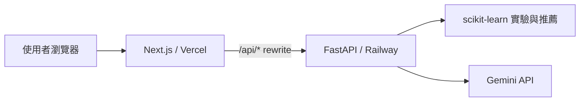

# Industry ML Workbench

[](https://nextjs.org/)
[](https://fastapi.tiangolo.com/)
[](https://scikit-learn.org/)
[](https://ai.google.dev/)
[](https://vercel.com/)
[](https://railway.com/)

以業界問題為出發點的互動式機器學習學習網站。使用者可以比較模型、調整參數、觀察指標與決策邊界，並讓 Gemini AI 助理依目前模型、參數和實驗結果提供解釋。

> **Live Demo：** [https://machine-learning-study.vercel.app](https://machine-learning-study.vercel.app)
>
> 此網址為預定正式網域；完成下方 Vercel 部署及網域設定後啟用。

## 專案特色

- **模型圖鑑**：整理常用監督式、非監督式與降維模型的適用情境、限制及業界用途。
- **模型選擇流程**：依任務、資料規模、可解釋性、延遲與類別不平衡條件提供可追溯的模型建議。
- **互動參數實驗**：支援 Ridge、邏輯回歸、決策樹、SVM、KNN 與 K-Means，直接觀察參數如何影響模型。
- **業界判讀**：除了分數，也呈現泛化差距、推論成本、人工處理量與實務風險。
- **Gemini AI 助理**：讀取目前頁面的模型、參數、指標與診斷碼，提供繁體中文說明及下一步建議。
- **前後端分離**：Next.js 負責展示與互動，FastAPI 負責模型計算、推薦規則與 Gemini API 呼叫。

## 系統架構



Gemini API Key 只儲存在 FastAPI 後端環境變數中。前端不使用 `NEXT_PUBLIC_GEMINI_API_KEY`，瀏覽器也不會取得金鑰。

## 技術架構

| 分層 | 技術 | 用途 |
| --- | --- | --- |
| 前端 | Next.js、React、TypeScript | 頁面、互動控制與資料視覺化 |
| 後端 | FastAPI、Pydantic、HTTPX | API、輸入驗證與 Gemini 串接 |
| 機器學習 | scikit-learn、NumPy | 固定種子的模型實驗與指標計算 |
| AI | Google Gemini API | 依目前實驗情境提供學習解釋 |
| 部署 | Vercel、Railway | 前端與後端分離部署 |

## 本機執行

### 1. 安裝依賴

```powershell
npm --prefix apps/web install
python -m pip install -r apps/api/requirements.txt
```

### 2. 設定 Gemini

在專案根目錄建立 `.env.local`：

```dotenv
GEMINI_API_KEY=你的_Gemini_API_Key
GEMINI_MODEL=gemini-2.5-flash
ALLOWED_ORIGINS=http://localhost:3000
```

`.env.local` 已被 Git 忽略，不應提交至 repository。

### 3. 啟動網站

```powershell
npm run dev
```

- 網站：[http://localhost:3000](http://localhost:3000)
- FastAPI 文件：[http://localhost:8001/docs](http://localhost:8001/docs)
- 後端健康檢查：[http://localhost:8001/api/health](http://localhost:8001/api/health)

## 部署方式

請依照 **Railway 後端 → Vercel 前端** 的順序部署。

### 1. 部署 FastAPI 到 Railway

1. 登入 [Railway](https://railway.com/)，選擇 **New Project → Deploy from GitHub repo**。
2. 選擇 `dec591nyc/Machine-Learning-Study` repository。
3. 進入後端服務的 **Settings**，將 **Root Directory** 設為 `/apps/api`。
4. 將 **Config File Path** 設為 `/apps/api/railway.json`。Railway 的設定檔不會自動跟隨 Root Directory，因此此路徑不可省略。
5. 在 **Variables** 加入：

```dotenv
GEMINI_API_KEY=你的_Gemini_API_Key
GEMINI_MODEL=gemini-2.5-flash
ALLOWED_ORIGINS=https://machine-learning-study.vercel.app
```

6. 部署完成後，進入 **Settings → Networking → Generate Domain**，取得例如 `https://your-api.up.railway.app` 的後端網址。
7. 開啟下列網址確認部署成功：

```text
https://your-api.up.railway.app/api/health
https://your-api.up.railway.app/docs
```

`apps/api/railway.json` 已設定 Railpack、啟動指令、健康檢查與失敗重啟策略。

### 2. 部署 Next.js 到 Vercel

1. 登入 [Vercel](https://vercel.com/)，選擇 **Add New → Project**。
2. 匯入 `dec591nyc/Machine-Learning-Study` repository。
3. 將 **Root Directory** 設為 `apps/web`；Framework Preset 使用 **Next.js**。
4. 在 **Environment Variables** 加入後端網址，且不要加上結尾 `/`：

```dotenv
API_ORIGIN=https://your-api.up.railway.app
```

5. 按下 **Deploy**。部署完成後，在 **Settings → Domains** 將正式網域設為：

```text
machine-learning-study.vercel.app
```

6. 若 Vercel 實際分配了不同網域，請將 Railway 的 `ALLOWED_ORIGINS` 改成該正式網址，並同步更新本 README 的 Live Demo link。

### 3. 部署後檢查

- 首頁、模型圖鑑、模型選擇、模型比較與參數實驗皆可正常開啟。
- 調整參數後，瀏覽器對 `/api/experiments` 的請求回傳 `200`。
- AI 助理能取得目前模型情境並送出問題。
- Gemini 若回傳 `429`，代表 Google AI Studio 專案的額度或速率限制，不是 Vercel 與 Railway 連線失敗。
- GitHub 後續推送到 `main` 時，Vercel 與 Railway 可依各自的 GitHub deployment 設定自動重新部署。

## 專案結構

```text
apps/
├── api/                 FastAPI、模型實驗、推薦規則與 Gemini 服務
└── web/                 Next.js 網站與互動元件
docs/                    開發計畫
scripts/                 本機啟動與教材建置腳本
study-guide/             機器學習實用教材
output/pdf/              教材 PDF
```

## 驗證指令

```powershell
npm run test
npm run lint
npm run build
```

## 開發收穫

- 重新整理 Next.js 前端與 FastAPI 後端的責任邊界，讓模型運算與 API Key 保留在後端。
- 將模型教學從靜態文字轉成可調參數的互動實驗，讓使用者觀察複雜度、泛化與業務代價之間的關係。
- 練習以規則透明、可追溯的方式建立模型選擇流程，而不是只回傳單一推薦結果。
- 串接 Gemini 時同步處理金鑰保護、輸入長度、對話歷史、錯誤狀態與免費額度限制。
- 使用 Vercel 與 Railway 規劃前後端分離部署，並以健康檢查和環境變數管理維持可部署性。

## Repository

[](https://github.com/dec591nyc/Machine-Learning-Study)
